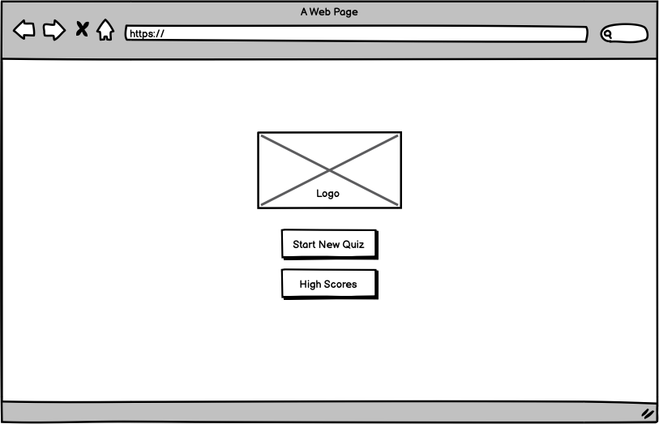
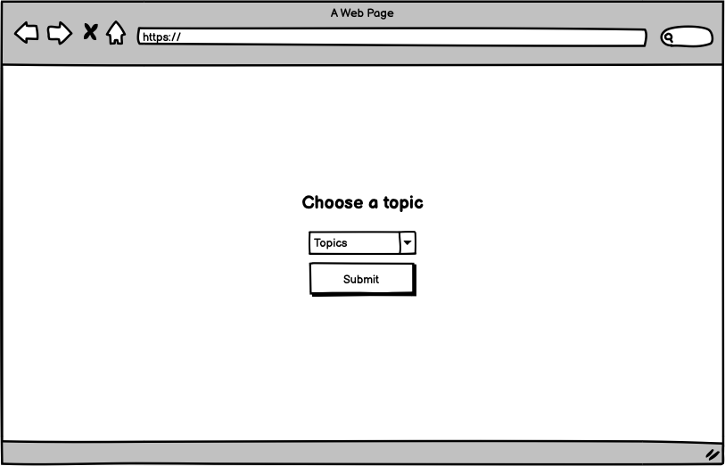
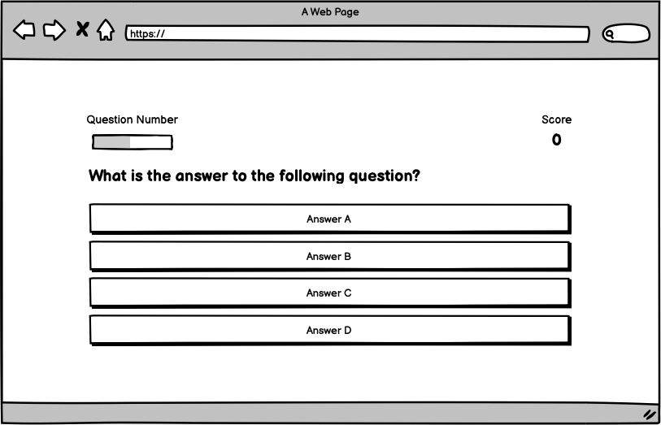
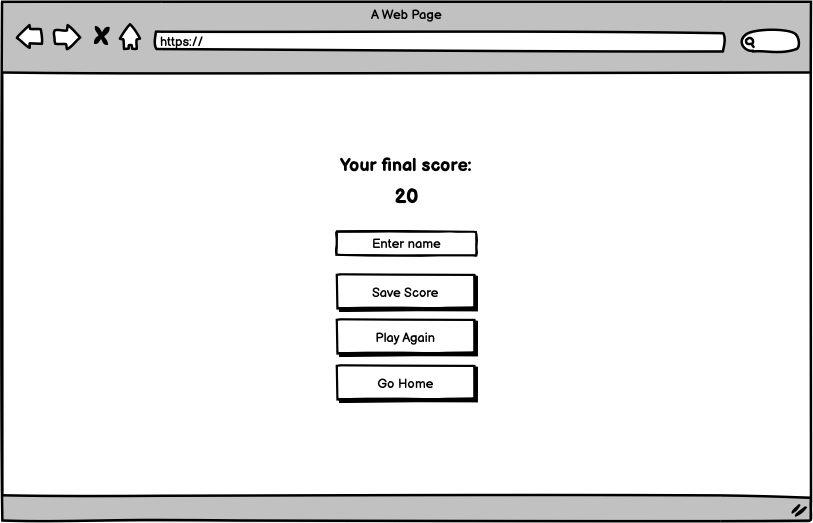

# **Exquizite**

[View the live project here](https://danielanthonycollins.github.io/exquizite/)

## **Site Overview**

Exquizite is an online quiz game featuring 10 multiple choice questions in the users topic of choice. The target audience is quiz enthusiasts, quiz teams looking to practice before an event or anyone looking to pass the time with a fun game.

## **Table of contents**

- [**Exquizite**](#exquizite)
  - [**Site Overview**](#site-overview)
  - [**Table of contents**](#table-of-contents)
  - [**Planning stage**](#planning-stage)
    - [**Target Audiences**](#target-audiences)
    - [**User Stories**](#user-stories)
    - [**Site Aims**](#site-aims)
    - [**Wireframes**](#wireframes)
    - [**Color Scheme**](#color-scheme)
  - [**Typography**](#typography)
  - [**Features**](#features)
  - [**Future Enhancements**](#future-enhancements)
  - [**Testing Phase**](#testing-phase)
    - [**Responsiveness**](#responsiveness)
    - [**Functionality**](#functionality)
    - [**Validators**](#validators)
    - [**Lighthouse**](#lighthouse)
    - [**Testing user stories**](#testing-user-stories)
  - [**Bugs**](#bugs)
  - [**Deployment**](#deployment)
  - [**Tech**](#tech)
  - [**Credits**](#credits)
    - [**Honourable mentions**](#honourable-mentions)
    - [**Content**](#content)
    - [**Media**](#media)

## **Planning stage**

### **Target Audiences**

- Casual users looking for a quiz game to pass the time.
- Quiz enthusiasts and/or teams looking to test their knowledge before a competition.
- Casual users looking for a fun game to entertain guests at a party or gathering.

### **User Stories**

- As a user, I want the site to be easy to use.
- As a user, I want to the site to be responsive.
- As a user, I want to choose the topic for the quiz questions
- As a user, I want to answer different questions each time I take the quiz, even if I choose the same topic.

### **Site Aims**

- To offer a simple, yet interesting quiz game that can be played multiple times without repetition of questions to keep the users engaged.
- To offer multiple topics, creating the largest possible target audience.
- To keep the user informed on their progress as they advance through the quiz.
- To display a leaderboard so users can compare their results with others, hopefully encouraging them to keep playing or come back and try again at a later time.

### **Wireframes**

Home Page (Desktop, Tablet & Mobile)

Game Page - Select Topic (Desktop, Tablet & Mobile

Game Page - Questions (Desktop view shown, on tablet and mobile layout is to be the same although everything should wrap to the next line where required)

End Page with Final Score (Desktop, Tablet & Mobile)

High Scores Page (Desktop, Tablet & Mobile)

### **Color Scheme**

I decided to use a navy background with lighter blue buttons and white text to jump out off the page. I think navy is a very modern, inviting color and a lot of apps and websites seem to be moving towards a darker theme with bright wording and features, rather than the other way around.

## **Typography**

I decided to import the Urbanist font from Google Fonts as I felt that it worked with the overall theme of the quiz. It looks like a modern, easy to read font.

## **Features**

To be completed

## **Future Enhancements**

- The high scores leaderboard could be improved in the future to store scores on a server rather than on local storage, which will open the quiz up to more competition in future.
- More quiz options could be introduced in future, such as difficulty and number of questions to further customize the quiz to the users preferences.
- Functionality could be introduced in future to create levels which the user can progress through. To pass to the next level they would have to reach a certain quiz score, and each level is harded than the last.

## **Testing Phase**

### **Responsiveness**

To be completed

### **Functionality**

To be completed

### **Validators**

To be completed

### **Lighthouse**

To be completed

### **Testing user stories**

**User story 1**: As a user, I want the site to be easy to use.

**Achieved?**: Yes. The quiz includes features and instructions which are clear to the user as they progress through the quiz and allows them to start and finish successfully.

**User story 2**: As a user, I want to the site to be responsive.

**Achieved?**: Yes. The quiz has been designed and tested to be responsive on all devices.

**User story 3**: As a user, I want to choose the topic for the quiz questions

**Achieved?**: Yes. The quiz prompts the user to select from a variety of topics before they begin.

**User story 4**: As a user, I want to answer different questions each time I take the quiz, even if I choose the same topic.

**Achieved?**: Yes. The quiz provides different questions for each game, even if the user plays multiple times choosing the same topic as they do so.

## **Bugs**

I found the following bugs during the development process:

- GitHub Pages
  - Problem: When the project was deployed to GitHub Pages and the start quiz button is clicked, a 404 page appeared saying the link was unknown.
  - Cause: After troubleshooting the issue on slack, I found that GitHub pages does not like absolute flle paths, which were included in my code to send the user to the relevant page based on the button clicked or action taken.
  - Solution: All file paths in all documents were changed to relative by removing the first forward slash.

---

## **Deployment**

I deployed the page on GitHub pages via the following procedure:

1. From the project's [repository](https://github.com/danielanthonycollins/exquizite), go to the **Settings** tab.
2. From the left-hand menu, select the **Pages** tab.
3. Under the **Source** section, select **Deploy from a branch** and then the **Main** branch from the drop-down menu and click **Save**.
4. A message will be displayed to indicate a successful deployment to GitHub pages and provide the live link.

You can find the live site [here](https://danielanthonycollins.github.io/exquizite/)

---

## **Tech**

- HTML5
- CSS3
- JavaScript

## **Credits**

The following people, websites and learning materials aided me with the creation of this project.

### **Honourable mentions**

Special thanks to my mentor Richard Wells for his excellent advice and support throughout this project.

### **Content**

I used the [James Q Quick](https://youtu.be/rFWbAj40JrQ?si=lEENGptMdV2F396F) Youtube tutorial to create the base for my quiz.

### **Media**

The Exquizite logo was created and designed thanks to [logo.com](https://logo.com/), the free logo generator.