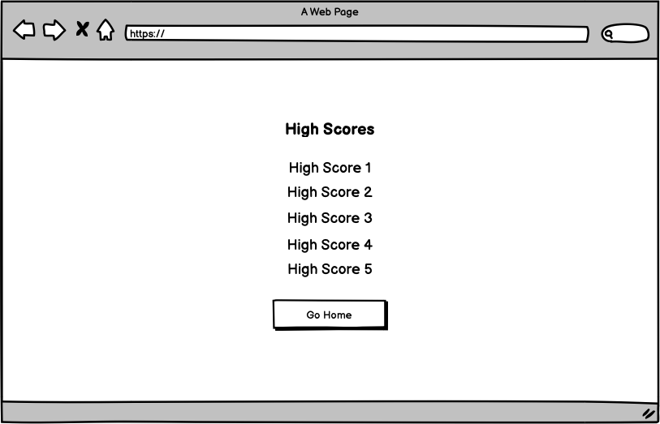

# **Exquizite**

[View the live project here](###)

## **Site Overview**

Exquizite is an online quiz game featuring 10 multiple choice questions in the users topic of choice. The target audience is quiz enthusiasts, quiz teams looking to practice before an event or anyone looking to pass the time with a fun game.

## **Table of contents**

- [**Exquizite**](#exquizite)
  - [**Site Overview**](#site-overview)
  - [**Table of contents**](#table-of-contents)
  - [**Planning stage**](#planning-stage)
    - [**Target Audiences**](#target-audiences)
    - [**User Stories**](#user-stories)
    - [**Site Aims**](#site-aims)
    - [**Wireframes**](#wireframes)
    - [**Color Scheme**](#color-scheme)
  - [**Typography**](#typography)
  - [**Features**](#features)
  - [**Future Enhancements**](#future-enhancements)
  - [**Testing Phase**](#testing-phase)
    - [**Responsiveness**](#responsiveness)
    - [**Functionality**](#functionality)
    - [**Validators**](#validators)
    - [**Lighthouse**](#lighthouse)
    - [**Testing user stories**](#testing-user-stories)
  - [**Bugs**](#bugs)
  - [**Deployment**](#deployment)
  - [**Tech**](#tech)
  - [**Credits**](#credits)
    - [**Honourable mentions**](#honourable-mentions)
    - [**Content**](#content)
    - [**Media**](#media)

## **Planning stage**

### **Target Audiences**

- Casual users looking for a quiz game to pass the time.
- Quiz enthusiasts and/or teams looking to test their knowledge before a competition.
- Casual users looking for a fun game to entertain guests at a party or gathering.

### **User Stories**

- As a user, I want the site to be easy to use.
- As a user, I want to the site to be responsive.
- As a user, I want to choose the topic for the quiz questions
- As a user, I want to answer different questions each time I take the quiz, even if I choose the same topic.

### **Site Aims**

- To offer a simple, yet interesting quiz game that can be played multiple times without repetition of questions to keep the users engaged.
- To offer multiple topics, creating the largest possible target audience.
- To keep the user informed on their progress as they advance through the quiz.
- To display a leaderboard so users can compare their results with others, hopefully encouraging them to keep playing or come back and try again at a later time.

### **Wireframes**

Home Page (Desktop, Tablet & Mobile)

Game Page - Select Topic (Desktop, Tablet & Mobile

Game Page - Questions (Desktop view shown, on tablet and mobile layout is to be the same although everything should wrap to the next line where required)

End Page with Final Score (Desktop, Tablet & Mobile)

High Scores Page (Desktop, Tablet & Mobile)

### **Color Scheme**

To be completed

## **Typography**

To be completed

## **Features**

To be completed

## **Future Enhancements**

To be completed

## **Testing Phase**

### **Responsiveness**

To be completed

### **Functionality**

To be completed

### **Validators**

To be completed

### **Lighthouse**

To be completed

### **Testing user stories**

**User story 1**: To be completed

**Achieved?**: To be completed

## **Bugs**

I found the following bugs during the development process:

---

## **Deployment**

I deployed the page on GitHub pages via the following procedure:

1. From the project's [repository](https://github.com/danielanthonycollins/exquizite), go to the **Settings** tab.
2. From the left-hand menu, select the **Pages** tab.
3. Under the **Source** section, select **Deploy from a branch** and then the **Main** branch from the drop-down menu and click **Save**.
4. A message will be displayed to indicate a successful deployment to GitHub pages and provide the live link.

You can find the live site [here](###)

---

## **Tech**

- HTML5
- CSS3
- JavaScript

## **Credits**

To be completed

### **Honourable mentions**

Special thanks to my mentor Richard Wells for his excellent advice and support throughout this project.

### **Content**

To be completed

### **Media**

To be completed